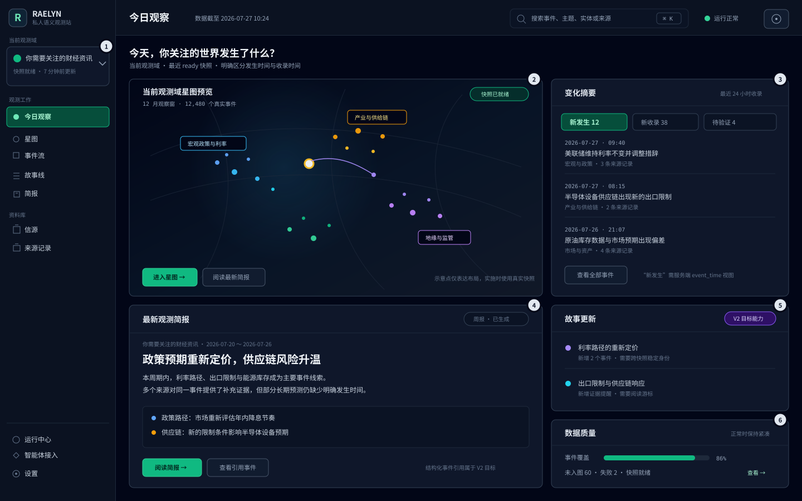
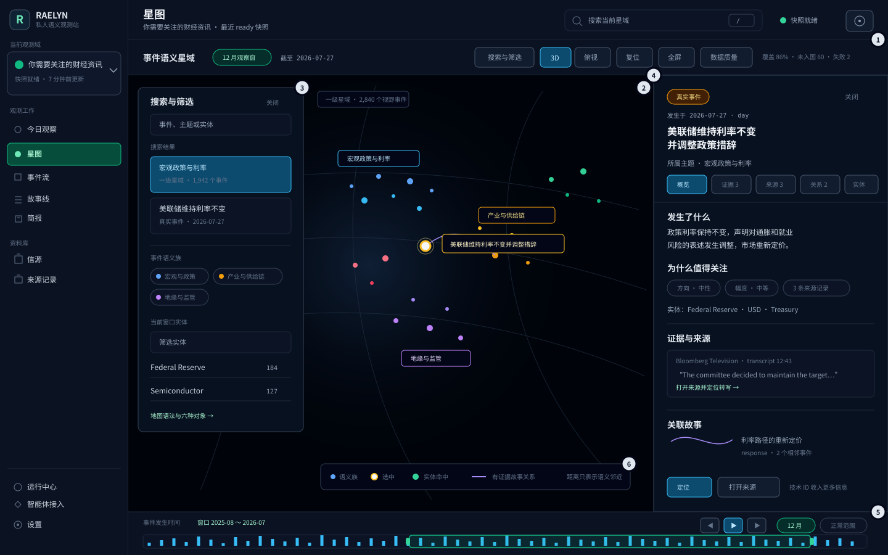

# Raelyn V2 首页与星图低保真线框

## 文档状态

本文用低保真线框验证 [V2 信息架构](../product/information-architecture-v2.md) 的页面层级与关键交互，不是最终视觉稿，也不表示对应接口已经全部实现。

线框遵循以下约束：

- 保留深色 App Shell、固定顶栏、侧栏和全高内容面板；
- 使用当前 Emerald 主交互色和事件星域已有的语义色语法；
- 不增加外部字体、图片或 CDN 资源；
- 图中的星点、标题和数量均为布局占位，不代表真实业务数据；
- 实际实现只能渲染真实 canonical 事件、主题和有证据的故事关系。

## 首页：今日观察

### 布局说明

| 编号 | 区域 | 目的 | 数据边界 |
| --- | --- | --- | --- |
| 1 | 观测域切换器 | 将 Playlist 提升为全局工作上下文 | 可复用播放列表列表与详情 |
| 2 | 星图预览 | 用当前 ready 快照建立领域全景入口 | 可复用 manifest 与 scene |
| 3 | 变化摘要 | 明确区分新发生、新收录和待审核 | 新收录与审核可复用；新发生需服务端排序 |
| 4 | 最新简报 | 提供当前周期的主要阅读入口 | 可复用简报接口 |
| 5 | 故事更新 | 展示持续故事获得的新事件或证据 | 需故事目录与阅读游标 |
| 6 | 数据质量 | 展示覆盖、未入图和构建异常 | 可复用 map manifest，需页面聚合 |

### 首屏行为

- 默认打开上次使用的观测域；没有历史选择时进入观测域目录；
- 星图预览使用当前 ready snapshot，后台构建失败不移除旧 ready 视图；
- “新发生”使用事件发生时间，“新收录”使用系统获得时间；
- 首版没有阅读游标时使用“最近 24 小时”“当前观察窗口”等明确文案；
- 点击星图预览进入星图并继承观察窗口；
- 点击事件进入事件详情，保留返回今日观察的路径；
- 点击简报引用后，目标实现应能定位事件或来源证据；
- 系统正常时不展示数据库、S3、模型调用和任务统计卡。

## 星图：事件语义星域

### 布局说明

| 编号 | 区域 | 目的 | 数据边界 |
| --- | --- | --- | --- |
| 1 | 单行工具栏 | 集中时间、类型、搜索、镜头和数据质量入口 | 可复用现有星域状态 |
| 2 | 中央画布 | 展示当前窗口内的 canonical 真实事件 | 只读取 pinned ready snapshot |
| 3 | 搜索与筛选抽屉 | 搜索主题、事件、实体并应用当前域筛选 | 可复用 map search 与 entity API |
| 4 | 事件详情 | 按理解与验证顺序组织事件信息 | 可复用 canonical detail，需补来源定位 |
| 5 | 时间轴 | 移动固定长度的事件发生时间窗口 | 只使用 `event_time` |
| 6 | 数据语法 | 解释语义色、选择、筛选和故事关系 | 不添加无业务含义的装饰对象 |

### 详情信息顺序

右侧详情不再首先暴露技术 ID，而按以下顺序组织：

1. 发生了什么；
2. 事件发生时间、类型和所属主题；
3. 为什么值得关注：方向、幅度、超预期及关联实体；
4. 底层事件记录；
5. 可验证证据；
6. 来源视频与转写定位；
7. 有证据的关联故事；
8. canonical ID、快照 ID 等技术信息。

### 交互原则

- 点击星点或主题只改变选择，不自动改变镜头；
- “定位”或搜索结果才显式聚焦；
- 时间、事件类型和实体筛选不重新布局；
- 选中主题时保留成员语义色，其他事件降低不透明度；
- 选中事件使用白芯金环；
- 实体筛选命中使用绿色；
- 故事关系使用紫色或青色短程曲线；
- 不显示全图实体连线、装饰星点、虚构故事边或全期参照；
- 数据质量、覆盖率和构建进度进入抽屉或异常提示，不持续占用画布。

## 响应式折叠

### 平板

- 侧栏折叠为图标栏或抽屉；
- 今日观察的变化摘要移动到星图预览下方；
- 星图详情作为右侧覆盖层打开；
- 工具栏按内容换行，但不拆成多个含义重复的标题栏。

### 手机

- 今日观察依次展示变化摘要、最新简报和星图入口；
- 星图默认全屏，搜索、筛选、详情和数据质量改为互斥抽屉；
- 时间轴保留拖动、上月、下月和播放；
- 事件流是星图的非空间替代入口；
- 不支持 WebGL2 时直接提供清晰错误和“转到事件流”操作。

## 线框不决定的内容

- 最终字体、字号微调和图标选择；
- 主题标签的真实文案；
- 首页聚合接口的最终响应结构；
- 故事关注和阅读游标的存储位置；
- 简报引用协议；
- 跨域搜索与统一全局星图；
- 观测域、Playlist 内部代码和 API 的最终迁移方式。
